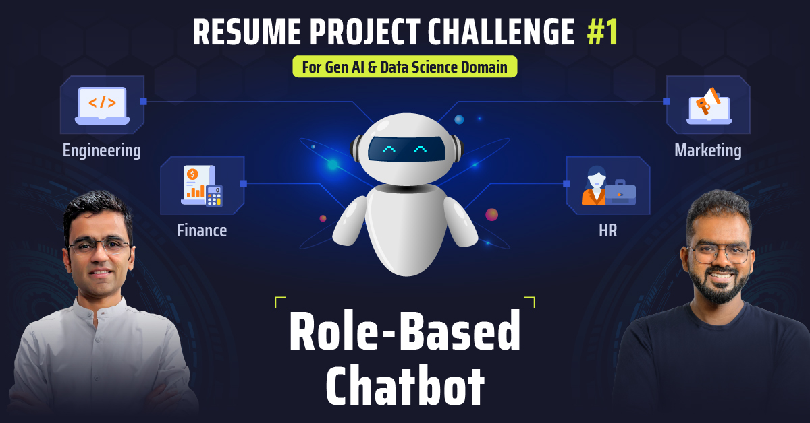

HEAD
# RBAC Chatbot with Document Ingestion

A Role-Based Access Control (RBAC) chatbot system with document ingestion, semantic search, and a modern Streamlit frontend.

## Features

- 🔐 **Role-Based Access Control**: Different access levels for different user roles
- 📄 **Document Ingestion**: Load and process markdown/text documents
- 🔍 **Semantic Search**: Vector-based document retrieval using ChromaDB
- 🤖 **AI Chat**: Powered by Groq LLM API for intelligent responses
- 🎨 **Modern UI**: Beautiful Streamlit frontend with banner image
- 🔒 **Authentication**: JWT-based authentication system

## Quick Start

### 1. Install Dependencies
```bash
pip install -r requirements.txt
```

### 2. Set Environment Variables
Create a `.env` file with your Groq API key:
```
GROQ_API_KEY=your_groq_api_key_here
```

### 3. Ingest Documents
```bash
python scripts/ingest.py
```

### 4. Start the Application
```bash
python start_servers.py
```

This will start both the FastAPI backend and Streamlit frontend.

## Access Points

- **Frontend**: http://localhost:8501
- **API Documentation**: http://localhost:8000/docs
- **Health Check**: http://localhost:8000/health

## User Roles

- **Engineering**: Access to technical documentation
- **Finance**: Access to financial reports
- **HR**: Access to employee policies
- **Marketing**: Access to marketing materials

## Default Credentials

- Username: `Tony`
- Password: `password123`
- Role: Engineering

- Username: `Bruce`
- Password: `securepass`
- Role: Marketing

- Username: `Sam`
- Password: `financepass`
- Role: Finance

- Username: `Peter`
- Password: `pete123`
- Role: Engineering

- Username: `Sid`
- Password: `sidpass123`
- Role: Marketing

- Username: `Natasha`
- Password: `hrpass123`
- Role: HR

## Architecture

- **Backend**: FastAPI with JWT authentication
- **Frontend**: Streamlit with modern UI
- **Vector Store**: ChromaDB with HuggingFace embeddings
- **LLM**: Groq API for response generation
- **RBAC**: Role-based document access control
=======
# DS RPC 01: Internal chatbot with role based access control

This is the starter repository for Codebasics's [Resume Project Challenge](https://codebasics.io/challenge/codebasics-gen-ai-data-science-resume-project-challenge) of building a RAG based Internal Chatbot with role based access control. Please fork this repository to get started.

Basic Authentication using FastAPI's `HTTPBasic` has been implemented in `main.py` for learners to get started with.

Visit the challenge page to learn more: [DS RPC-01](https://codebasics.io/challenge/codebasics-gen-ai-data-science-resume-project-challenge)

### Roles Provided
 - **engineering**
 - **finance**
 - **general**
 - **hr**
 - **marketing**

**Engineering**
What is the system architecture of FinSolve Technologies?
Which technologies are used in the backend and frontend?
How does the API Gateway handle authentication and rate limiting?
What is the process for disaster recovery and backups?
How does the company ensure high availability and fault tolerance?
What are the coding standards and code review requirements?
What is the software development lifecycle at FinSolve?
How are microservices deployed and managed?
What is the process for automated testing and CI/CD?
How is security enforced in the engineering workflow?
**Finance**
What was the company’s revenue growth in 2024?
Can you summarize the main expense categories for 2024?
What is the gross margin and net margin for the year?
How did vendor costs impact profitability?
What are the recommendations for cost optimization?
What are the key financial risks and mitigation strategies?
How did cash flow from operations change over the year?
What were the main drivers of marketing spend?
What is the operating expenses to revenue ratio?
What are the quarterly highlights for revenue and net income?
**HR**
What is the leave balance for a specific employee?
How many leaves has an employee taken this year?
What is the attendance percentage for employees in the HR department?
Who are the HR managers in the company?
What is the performance rating of a specific employee?
What is the process for updating employee information?
How can I find the date of joining for an employee?
What is the average leave balance across all employees?
Who manages the HR department?
How do I contact the HR manager?
**Marketing**
What were the main marketing campaigns in 2024?
How much was spent on digital marketing versus event marketing?
What was the ROI of the “InstantWire Global Expansion” campaign?
What are the key customer acquisition metrics for 2024?
How did brand awareness change over the year?
What are the recommendations for improving marketing performance?
Who were the top-performing vendors for marketing?
What is the customer acquisition cost (CAC) and customer lifetime value (CLTV)?
What are the main geographic growth areas for the company?
How did social media engagement impact customer acquisition?